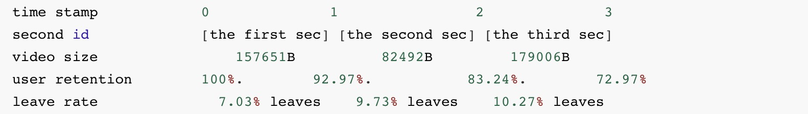

# ACM Multimedia 2022 Grand Challenge: Short Video Streaming
This repository contains the simulator code used for ACM Multimedia 2022 Short Video Streaming.  The simulator is a short video streaming simulator with a pluggable client module for participant defined download control algorithms.

***Details of the update in each version is listed at the end of README.*** 

> Currently at Version 1 ：Updated at 4/22

# Quick Start

We provide a demo which aims at helping you to learn what parameters you need to decide in the challenge. It only gives you some clues to things you can do to improve the algorithm, so it isn't necessarily reasonable. You need to find a better solution to balance QoE and bandwidth waste.

You can evaluate the demo by the following command:

```bash
python run.py --quickstart fixed_preload
```
Now you have successfully run the demo, which can be used directly in the submission. Please read comments in fixed_preload.py for more details.

# Your Task

Please design an algorithm which decides `download_video_id`, `bit_rate` and `sleep_time` according to input.

**Input**:

- delay

  > The time cost of your last operation.

- rebuf

  > The length of rebufferment.
  
- video_size

  > The size of the last downloaded chunk.

- end_of_video

  > If the last download video was ended.

- play_video_id

  > The id of the current video.

- Players

  > The video data of the RECOMMEND QUEUE.

+ first_step

  > Whether it is the first operation.

**Output**:

- download_video_id

  > The id of the next download video.

- bit_rate

  > Bit rate level of next download chunk, ranging from *0* to *2*. *0* is the lowest and *2* is the highest.

+ sleep_time

  > Stop downloading for `sleep_time `. The unit is ms.

**The evaluation will be based on**:

- QoE
  
  > A reflection of user experience. It is related to bit rate, rebufferment and bit rate fluctuations between different chunks of one video.
  
- Bandwidth wastage

  > Some chunks which have been downloaded will not be watched. Try reducing bandwidth wastage.

- Downloaded/watched time ratio
  
  > The ratio is defined as downloaded time / total watch time.

# File Structures

#### 0. Data

The data files are placed under `/data`:

- /short_video_size：currently there are seven different videos

  | Video Name<br /> (directory name) | Time (s) |  Video Type   |
  | :-------------------------------: | :------: | :-----------: |
  |               1_tj                |    17    |     Study     |
  |               2_EDG               |    26    | Entertainment |
  |               3_gy                |    37    |     Life      |
  |               4_dx                |    40    |     Life      |
  |               5_ss                |    47    |     Life      |
  |               6_jt                |    6     | Entertainment |
  |               7_yd                |   125    |     Game      |

  In each directory,  there are data of three bit rate levels of this video, ranging from *0* to *2*. *0* is the lowest and *2* is the highest. The video size of each chunk is 1000 ms. For example, a video of 3 chunks( 1s/chunk, with a total time length of 3 seconds ) can be described as follows:

  ```
  157651
  82492
  179006
  ```

- /network_traces：the network condition, pesented in [time (*s*), bandwidth (*Mbps*) ] groups

  For example, the following data means the bandwidth from 0.0 to 0.5499999 (*s*) is 4.03768755221(*Mbps*), other rows can be translated likewise.

  ```
  0.0	4.03768755221
  0.549999952316	4.79283060109
  0.879999876022	4.49231799163
  ```

- /user_ret：describes a user retention model of each video which we generate 

  For example, a video of 3 seconds can take the following form: 

  ```
  0	1
  1	0.929794029
  2	0.832466432
  3	0.729774475
  4 0
  ```

  It means that 92.98% of users are still watching when the clock tick 1 second(at the end of the first second), 83.24% of users are still watching at time 2.0sec. Specifically, 72.97% of users still exist at 3.0 sec, which means that they watched the whole video. 

  *Cautious:* The last (4 0) is only an end mark, the actual length is 3 seconds.
  
  The leave ratio can be deducted from subtracting one retention rate with its former retention rate. For instance, (92.97 - 83.24) % = 9.73% of users leave within the 1s-2s period.
  

The video data structure may seem confusing at first, we provide a detailed illustration below:

#### 

#### 1. Simulator

The simulator files are placed under `/simulator`:

- controller.py

  `controller.py` contains the main module your algorithm will interact with. It imports the datasets, creates the test environment, and simulates the whole process of your decision step.

- network_module.py

  `network_module` holds a class that can save and operate with network conditions.

- short_video_load_trace.py

  `short_video_load_trace.py` mainly provides an interface for loading datasets.

- user_module.py

  `user_module.py` maintains a class of user model and simulate user actions.

- **video_player.py**

  `video_player.py` is the video player modules which handles most of your actions for each video, including downloading and watching. 

  We strongly recommend you reading this file cause you will be receiving an instance of this class as a feedback from our simulator for each of your decisions.

#### 2. Evaluating program

You can evaluate your program with our simulator by simply running the `run.py` under the root directory.

##### The args:

- `--baseline`, `--solution`：choose the algorithm you are evaluating

- `--trace`: (optional) choose the type of trace you are evaluating from "mixed", "medium", "low", "high". By default, trace would be set to mixed.

1）Run a baseline algorithm

We have one baseline algorithm `no_save`, which you can refer to the content introduction for details. 

You can run the baselines to get a basic idea of our simulator and how you can interact with it.

```bash
python run.py --baseline no_save
```

2）Run your own algorithm

You can input your relative code directory path to `run.py` as argument `--solution`. 

**By default**, if you haven't pass `--baseline` nor `--quickstart`,  the default setting will run the `solution.py  ` under the root directory.

```bash
python run.py --solution <Your relative code directory path>
```

For example, if you place your file under the `submit` dir under the root directory:

```bash
# Your file structure:
# run.py
# submit
#   |_solution.py
python run.py --solution ./submit/
```

##### The outputs:

You will get direct output on the screen apart from the log files. The output will include:

- The user actions:  when they stopped watching a video, we output the watch duration time and the downloaded time length.
- The final results: 
  - QoE
  - Bandwidth wastage
  - Downloaded/watched time ratio

#### 3. Log files

The log files are placed under `/logs`:

- `/logs/sample_user/user.txt`：The generated user watch durations for each video. 

- `/logs/log.txt`：The logs of your algorithm. It will output all steps of your decisions including:

  - *Which* chunk of the *which* video you choose to download?

  - Meanwhile, *which* chunk of video the user is playing? 

  Also, log file will include the influence of QoE from your decision:
  
  - The change of video qualities within a single video
  - The rebuffering time if you have caused a rebuffer

#### 4. Submit

The directory `/submit` provides a sample for the directory that you submit on our website. Your files should be organized as `submit.zip` (You can unzip it for details, we also list the structure below):

> submit
>
> |__solution.py   ——Your algorithm
>
> |__results  ——Your supplementary files, e.g. pretrained learning models.
>
> ​      |__......

# Update

### 4/22 Version 1

- **We change the argument name of your own algorithm path for `run.py`  from `--user` to `--solution` to prevent confusion with user model.**
- Expand video traces to 7 videos. Check `/data/short_video_size/` and `/user_ret` directory for details.
- Add `test_all_traces` function, which you can test on a specific set of traces (mixed, medium, high, low), each contains several distinct traces with similar patterns, and get the average indices.
  - By default, running `run.py` will be running this new function. If you want to test a certain trace, you can change the testing logic in `run.py` by yourself.
- Add `test_user_samples` function, which enables you to test several user samples at a time and get their average indices.
- Fix the QoE calculation issue. Thanks to https://github.com/AItransCompetition/Short-Video-Streaming-Challenge/issues/2.
